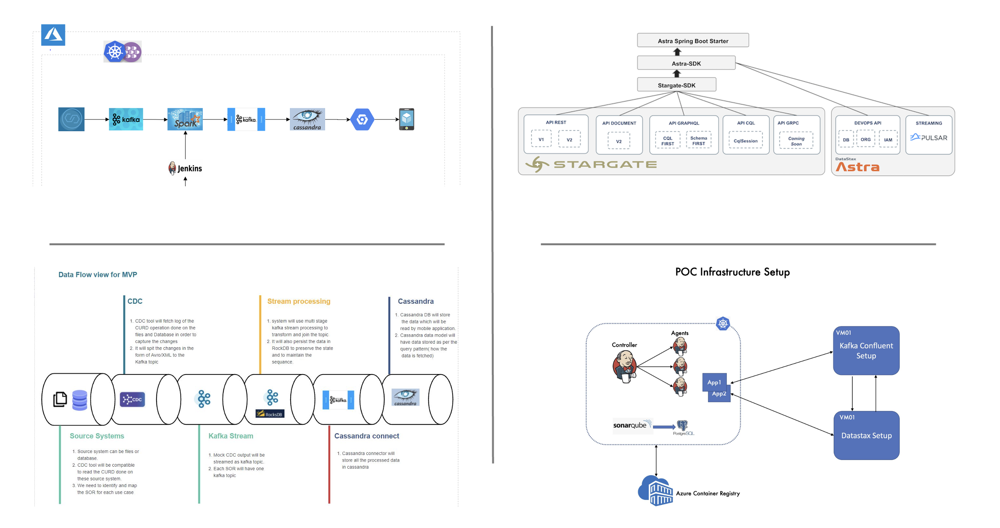

# Breaking Down the Application into Microservices

## Objective

The goal is to break down the application's functionality into distinct, self-contained business domains. Each domain represents a logical area of the system, focusing on a specific set of operations and workflows. This allows for independent ownership, scalability, and streamlined development.

## Approach

### 1. Identify Business Domains

#### Objective

Break down the application's functionality into distinct business domains. Each domain represents a logical area of the system, focusing on a specific set of operations and workflows.

#### Process

1. **Analyze the Application's Requirements:**
   - Gather and understand the application's functional and non-functional requirements.
   - Identify key processes, user interactions, and data flows.
   - Example: For an e-commerce application, analyze functionalities like user registration, product ordering, and payment processing.

2. **Identify Distinct Functionalities, Workflows, and Boundaries:**
   - Break down functionalities into discrete workflows.
   - Establish clear boundaries between workflows to minimize dependencies between services.
   - Example: User registration and login are distinct from order processing. Notifications are triggered as a separate, asynchronous operation.

3. **Group Related Operations Under a Single Domain:**
   - Consolidate operations with a common goal or shared data into a domain.
   - Domains should encapsulate the logic and data for the operations they own.
   - Example: User-related operations like login and profile updates are grouped under the User Management domain.

### 2. Example Domains

#### User Management

- **Purpose:** Handle all user-related operations.
- **Scope:**
  - User authentication and authorization (e.g., OAuth, JWT).
  - Managing user profiles and preferences.
  - Role-based access control (RBAC) to define user permissions.
- **Example Features:**
  - User registration.
  - Password reset.
  - Updating profile information.
- **Benefits:**
  - Simplifies scaling user-centric operations independently.
  - Improves security by isolating user data.

#### Order Processing

- **Purpose:** Manage the entire lifecycle of an order.
- **Scope:**
  - Creating and updating orders.
  - Tracking order status (e.g., Pending, Shipped, Delivered).
  - Interacting with inventory for stock validation.
- **Example Features:**
  - API for creating a new order.
  - Tracking delivery status.
  - Cancelling or updating an order.
- **Benefits:**
  - Decouples business-critical workflows.
  - Ensures flexibility in adding features like order prioritization or bundling.

#### Payment Gateway

- **Purpose:** Handle all payment-related operations securely and efficiently.
- **Scope:**
  - Processing payments and refunds.
  - Integration with third-party payment providers (e.g., Stripe, PayPal).
  - Logging payment transactions for audit purposes.
- **Example Features:**
  - Initiate payment for an order.
  - Process refunds for canceled or returned orders.
- **Benefits:**
  - Improves compliance with payment standards (e.g., PCI DSS).
  - Enables scalability to handle high transaction volumes.

#### Notification

- **Purpose:** Deliver notifications to users triggered by system events.
- **Scope:**
  - Managing notification templates (e.g., order confirmation, password reset).
  - Handling multiple channels (email, SMS, push notifications).
  - Logging notification history for reference.
- **Example Features:**
  - Sending an email for order confirmation.
  - Delivering SMS alerts for payment updates.
- **Benefits:**
  - Decouples communication workflows from other services.
  - Scales independently for bulk notifications.

## Advantages of Domain Identification

- **Clear Ownership:** Each domain has its own team, codebase, and infrastructure.
- **Independent Scalability:** Domains like Payment Gateway and Notifications can scale separately based on workload.
- **Enhanced Modularity:** Simplifies maintenance, testing, and feature addition.

