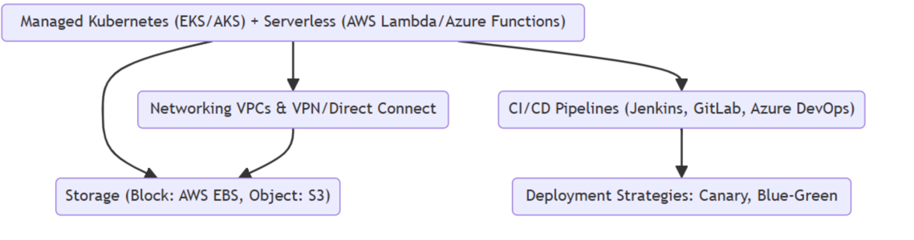
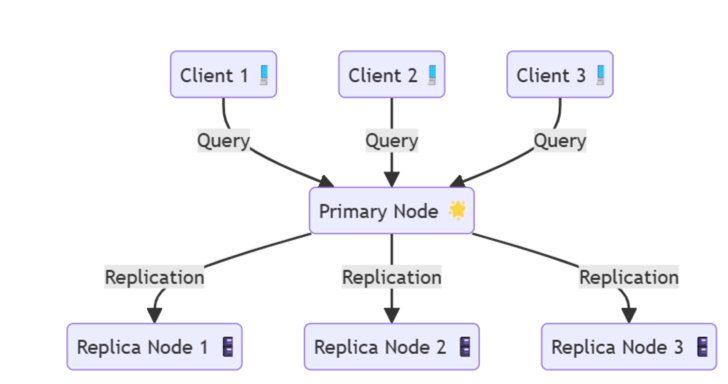
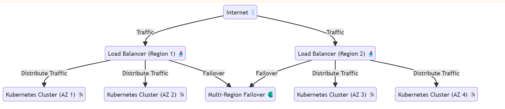
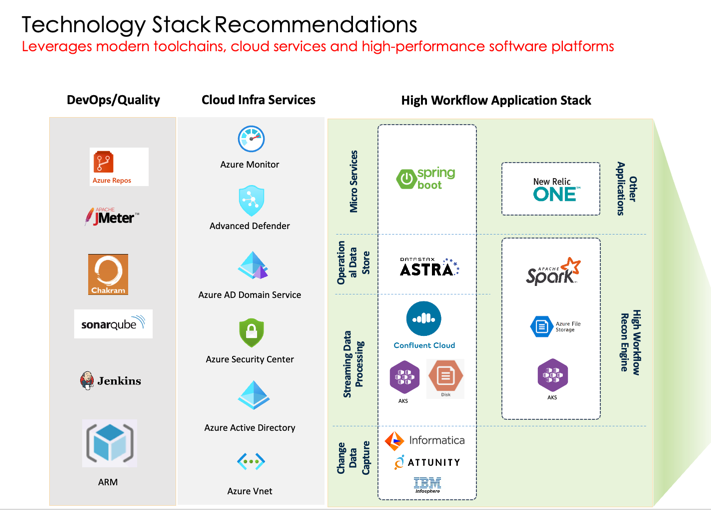
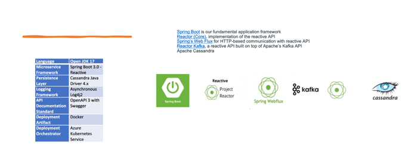
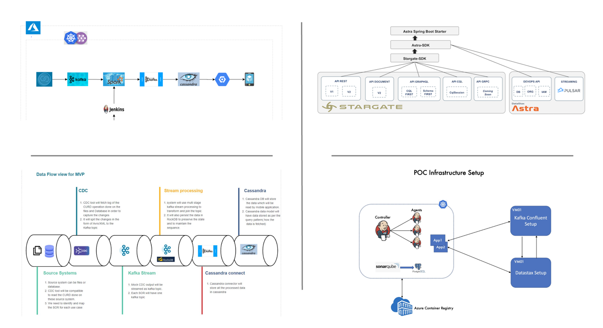

# High-Workload System Design

This document provides a comprehensive design solution for a high-workload system, encompassing both application architecture and infrastructure/platform design. The focus is on scalability, reliability, and performance optimization.

## System Objectives

- **Handle millions of requests per second.**
- **Ensure high availability (99.99% uptime).**
- **Support horizontal scalability.**
- **Ensure low latency for critical operations.**
- **Be fault-tolerant and resilient against infrastructure failures.**
- **Ensure data integrity and consistency.**

## Application Architecture

### Microservices-Based Architecture

#### Core Features

- **Decompose the system into domain-driven microservices.**
- Each service handles a specific business domain and communicates via APIs (REST or GraphQL).
- Use event-driven architecture for asynchronous operations.

#### Components

- **API Gateway:** Acts as a single entry point, manages authentication, throttling, and request routing.
  - **Tool:** AWS API Gateway / Kong / NGINX.

- **Service Communication:**
  - **Synchronous:** gRPC for high-performance inter-service communication.
  - **Asynchronous:** Kafka for message streaming and event handling.

- **Database Strategy:**
  - **Polyglot Persistence:**
    - Relational DB (e.g., PostgreSQL) for transactional data.
    - NoSQL (e.g., MongoDB, Cassandra) for high-throughput data.
    - In-memory stores (e.g., Redis, Memcached) for caching.
  - **Sharding and Replication** for scaling.

- **Caching:**
  - Use caching layers for frequently accessed data.
  - Implement Content Delivery Networks (CDNs) for static assets.

- **Search:** Elasticsearch for indexing and querying large datasets.

- **Scalability:**
  - Stateless Services: Store session data in distributed caches.
  - Enable auto-scaling to handle traffic surges.

## Infrastructure/Platform Design

### Cloud-Native Approach

Deploy using a cloud provider like AWS, Azure, or GCP for scalability and managed services.

### Infrastructure Design

- **Containerization and Orchestration:**
  - Use Docker for containerization.
  - Deploy on Kubernetes (K8s) for orchestration (EKS, AKS, or GKE).

- **Load Balancing:**
  - Deploy global load balancers to distribute traffic across regions.
  - **Tools:** AWS ALB/ELB, NGINX.

- **Scaling:**
  - Horizontal Pod Autoscaling (HPA) for services.
  - Auto-scaling groups for VMs.

- **Monitoring and Observability:**
  - Use Prometheus and Grafana for real-time monitoring.
  - Integrate ELK Stack (Elasticsearch, Logstash, Kibana) for log analysis.
  - Implement distributed tracing with Jaeger or AWS X-Ray.

- **Disaster Recovery:**
  - Cross-region replication.
  - Scheduled backups using AWS Backup or Azure Recovery Services.

- **Security:**
  - Deploy WAF (Web Application Firewall).
  - Use IAM roles and policies for access control.
  - Enable TLS/SSL for data encryption in transit.
  - **Secrets Management:** HashiCorp Vault or AWS Secrets Manager.

### Platform Design

- **Compute:**
  - Use managed Kubernetes clusters (e.g., EKS/AKS).
  - Serverless compute for on-demand workloads (AWS Lambda, Azure Functions).

- **Networking:**
  - Use VPCs for isolated environments.
  - Configure VPN/Direct Connect for secure hybrid connectivity.

- **Storage:**
  - Block Storage (e.g., AWS EBS) for stateful workloads.
  - Object Storage (e.g., S3) for unstructured data.

- **CD/CI Pipelines:**
  - Use Jenkins, GitLab CI/CD, or Azure DevOps for automated pipelines.
  - Implement Canary/Blue-Green deployments.

## Key Architectural Diagrams

### High-Level Architecture

- Microservices communicating through an API Gateway and Kafka.
- Distributed database setup with primary and replica nodes.

### Infrastructure Layout

- Load Balancers distributing traffic across Kubernetes clusters.
- Multi-AZ and Multi-Region failover setup.

## Implementation Roadmap

- **Phase 1:** Design and implement core microservices.
- **Phase 2:** Integrate CI/CD pipelines and set up Kubernetes.
- **Phase 3:** Implement monitoring, security, and disaster recovery.
- **Phase 4:** Load testing and optimization for production readiness.

## Event-Driven Communication

### Kafka Event Producer

### Service Implementation Template (using Spring Boot)

### Kafka Event Consumer

## Caching Strategy

### Redis Configuration

## Database Strategy

### Repository Pattern Implementation

This implementation provides:

- Microservices architecture with clear separation of concerns
- Event-driven communication using Kafka
- Distributed caching with Redis
- Scalable database operations
- API Gateway for request routing and load balancing

Each service should be containerized and deployed independently, with proper health checks and circuit breakers implemented for resilience.

